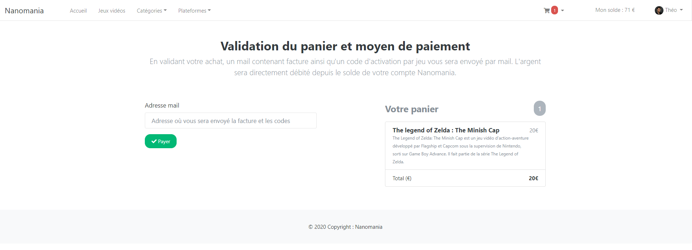

# Projet e-shopde 2ème année à Ynov Informatique

## Les objectifs visés

Les compétences à acquérir lors de la création de ce site e-commerce sont :  

- Framework web :
    + maîtriser les outils d'un Framework (Symfony pour ma part)
    + Mettre en place la persistance de données via un ORM
    + organiser son projet en respectant l'arborescence des fichiers du Framework
    + traiter des formulaires web (CRUD)
    + gérer le système d'authentification
- Créer un site web ergonomique :
    + structurer visuellement le contenu d’un site avec une démarche centrée utilisateur
- Créer un site web responsive :
    + mettre en œuvre les techniques du web adaptatif
- POO (Programmation Orientée Objet) :
    + programmer en orienté objet pour manipuler les données du site
- Créer des animations sur le site :
    + animer l’aspect graphique d’une page web en manipulant son contenu
- Base de données :
    + créer une base de données et des tables pour stocker les données du site
    + créer des requêtes SQL pour manipuler les données de votre base de données 
- Algorithme :
    + mettre en place des fonctionnalités mettant en avant vos compétences en algorithmie
- Serveur web :
    + mettre en place un environnement de développement
    + mettre en place un environnement de production
- Versionner son code :
    + utiliser un outil de versionning de code

## Présentation du site

Pour ce projet, j'ai choisi de réaliser un site vendant des jeux vidéos.  
Vous trouverez ce site à l'URL suivante : <http://theodelas.fr>  

***

### Visite du site
Ce site peut être visité sans être obligatoirement inscrit/connecté. Cependant il vous est alors impossible d'ajouter des articles à vos favoris ou dans votre panier, et donc d'acheter des jeux.  
(ci-dessous la page de détail d'un jeu sans être connecté)  

  
Pour pouvoir acheter des jeux, il vous faudra donc vous inscrire sur le site en vous créant un compte via un formulaire, puis de vous connecté avec ce compte.  
A partir de la, vous aurez la possibilité d'effectuer vos achats.  
(ci-dessous la page de détail d'un jeu en étant connecté)  

  

***

### Avis client
La page d'accueil du site est un page montrant les 3 jeux les mieux notés (notes données par les utilisateurs).  
Il vous est donc possible de donner votre avis sur un jeu, que vous l'ayez acheté ou non.  
Cependant, si vous avez acheté le jeu sur ce site, un petit macaron se trouvera en haut a droite de votre commentaire afin de l'indiquer aux autres utilisateurs.  
(voir ci-dessous)  

  

***

### Favoris
Vous pouvez ajouter un article à votre liste de favoris. Vous devez être connecté pour avoir accès à cette fonctionnalité.  
Il suffit d'appuyer sur le bouton "Ajouter à ses favoris" présent sur les pages détails de chaque jeu, ou sur la page d'accueil.  
Vous pouvez alors visiter votre liste de jeux favoris depuis votre espace membre (en haut à droite)  

  

***

### Achat d'un produit
Une fois inscrit et connecté à votre compte, vous pouvez acheter un produit.  
Un bouton "Ajouter au panier" apparait sur la fiche détaillé des produits, mais aussi sur chaque produit sur l'écran d'accueil.  
Une fois ajouté au panier, vous pouvez continuer vos achats (ajouter d'autres produits), consulter votre panier, supprimer des articles de votres panier, et le valider.  
Vous pouvez consulter votre panier depuis n'importe ou depuis le site via la barre de navigation (voir ci-dessous).  

  

Mais aussi depuis votre profil, à la page dédiée  

  

Vous pouvez alors valider votre panier (si votre solde est suffisant).  
Une page avec un récapitulatif de votre commande s'affiche. Vous devez saisir l'adresse mail sur laquelle vous souhaitez recevoir votre facture ainsi que les codes d'activation de vos jeux.  

  

***

### Son compte
Vous pouvez à tout moment modifier vos informations personnelles, votre mot de passe, photo de profil ...  

  

Un formulaire vous permet de mdofier vos information personnelles  

 

Une page vous permet de voir toutes vos factures  

 

***

### Partie Administrateur
Un formulaire dédié à la connexion admin s'ouvre, et seul mon compte à accès à cette partie.  

#### Admin - Dashboard
La page principale de cette partie est le Dashboard. Celle-ci regroupe quelques informations concernant le site :  
+ le nombre d'utilisateurs inscrit  
+ le nombre de jeux en vente  
+ le nombre de commentaires  
+ le nombre de jeux en vente en fonction des plateformes sur lesquelles les jeux sont achetable  

 

#### Admin - Utilisateurs
La partie utilisateur regroupe tous les utilisateurs inscrits sur le site.  
L'admin peut supprimer ou modifier lees informations d'un utilisateur (sauf le mot de passe evidemment) depuis cette page.

  

#### Admin - Jeux
Cette partie regroupe tous les jeux actuellement en vente sur le site.  
L'administrateur peut ajouter, modifier, supprimer un jeu depuis cette page.  

  

#### Admin - Plateformes
Cette dernière page regroupe les plateformes sur lesquelles les jeux peuvent être vendus.  
Comme la page des jeux, l'administrateur peut ajouter, modifier, supprimer une plateforme depuis cette page.  

